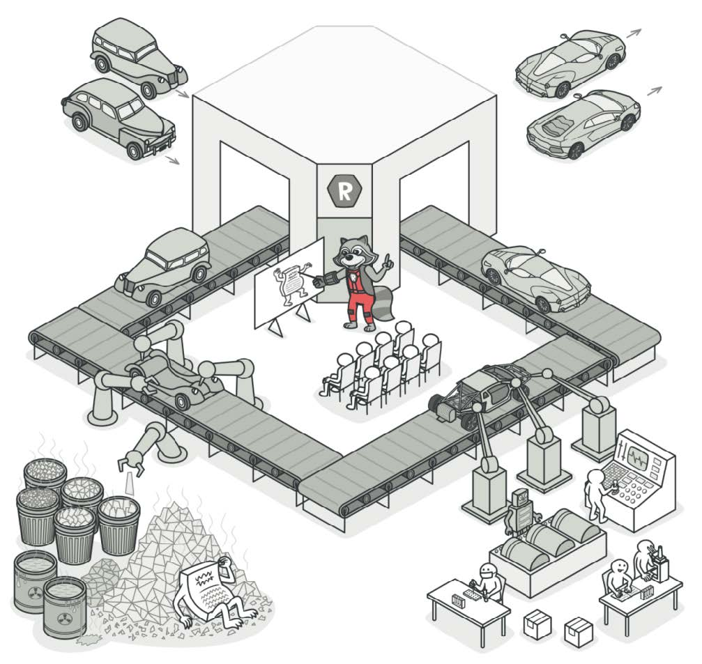

# Software Design Patterns -- Refactoring Report

<!-- TOC -->
- [Software Design Patterns -- Refactoring Report](#software-design-patterns----refactoring-report)
  - [1.Project Intorduction](#1project-intorduction)
    - [1.1 Project Background](#11-project-background)
    - [1.2 Project Function](#12-project-function)
      - [1.2.1 Player and Farm Features](#121-player-and-farm-features)
      - [1.2.2 Community and NPC Features](#122-community-and-npc-features)
      - [1.2.3 Exploration and Adventure Features](#123-exploration-and-adventure-features)
      - [1.2.4 Character Progression and System Features](#124-character-progression-and-system-features)
  - [Creational Patterns](#creational-patterns)
    - [Factory Pattern](#factory-pattern)
      - [Brief Introduction](#brief-introduction)
      - [Reason for Refactoring](#reason-for-refactoring)
      - [Refactoring Details](#refactoring-details)
      - [UML Class Diagram](#uml-class-diagram)
      - [Benefits of Refactoring](#benefits-of-refactoring)
  - [3. Structural Patterns](#3-structural-patterns)
      - [Brief Introduction](#brief-introduction-1)
      - [Reason for Refactoring](#reason-for-refactoring-1)
      - [Refactoring Details](#refactoring-details-1)
      - [UML Class Diagram](#uml-class-diagram-1)
      - [Benefits of Refactoring](#benefits-of-refactoring-1)
    - [3.2 Decorator Pattern](#32-decorator-pattern)
      - [3.2.1 Brief Introduction](#321-brief-introduction)
      - [3.2.2 Reason for Refactoring](#322-reason-for-refactoring)
      - [3.2.3 Refactoring Details](#323-refactoring-details)
        - [1. Abstract Component – `BaseCrop`](#1-abstract-component--basecrop)
        - [2. Concrete Component – `BasicCrop`](#2-concrete-component--basiccrop)
        - [3. Abstract Decorator – `CropDecorator`](#3-abstract-decorator--cropdecorator)
        - [4. Concrete Decorators – Five Crop State Classes](#4-concrete-decorators--five-crop-state-classes)
        - [5. Runtime Composition and Usage](#5-runtime-composition-and-usage)
      - [3.2.4 UML Class Diagram](#324-uml-class-diagram)
      - [3.2.5 Benefits of Refactoring](#325-benefits-of-refactoring)
        - [1. Clear separation of concerns](#1-clear-separation-of-concerns)
        - [2. Improved extensibility for new states](#2-improved-extensibility-for-new-states)
        - [3. Support for flexible state composition](#3-support-for-flexible-state-composition)
        - [4. Better readability and maintainability](#4-better-readability-and-maintainability)
        - [5. Easier testing and reuse](#5-easier-testing-and-reuse)
    - [Facade Pattern](#facade-pattern)
      - [Brief Introduction](#brief-introduction-2)
      - [Reason for Refactoring](#reason-for-refactoring-2)
      - [Refactoring Details](#refactoring-details-2)
      - [UML Class Diagram](#uml-class-diagram-2)
      - [Benefits of Refactoring](#benefits-of-refactoring-2)
  - [Behavioral Patterns](#behavioral-patterns)
    - [Chain of Responsibility Pattern](#chain-of-responsibility-pattern)
      - [Brief Introduction](#brief-introduction-3)
      - [Reason for Refactoring](#reason-for-refactoring-3)
      - [Refactoring Details](#refactoring-details-3)
      - [UML Class Diagram](#uml-class-diagram-3)
      - [Benefits of Refactoring](#benefits-of-refactoring-3)
  - [Behavioral Patterns](#behavioral-patterns)
    - [Chain of Responsibility Pattern](#chain-of-responsibility-pattern)
      - [Brief Introduction](#brief-introduction-4)
      - [Reason for Refactoring](#reason-for-refactoring-4)
      - [Refactoring Details](#refactoring-details-4)
      - [UML Class Diagram](#uml-class-diagram-4)
      - [Benefits of Refactoring](#benefits-of-refactoring-4)
  - [Additional Patterns](#additional-patterns)
    - [Null Object Pattern](#null-object-pattern)
      - [Brief Introduction](#brief-introduction-5)
      - [Reason for Refactoring](#reason-for-refactoring-5)
      - [Refactoring Details](#refactoring-details-5)
      - [UML Class Diagram](#uml-class-diagram-5)
      - [Benefits of Refactoring](#benefits-of-refactoring-5)
  - [Additional Patterns](#additional-patterns)
    - [Null Object Pattern](#null-object-pattern)
      - [Brief Introduction](#brief-introduction-6)
      - [Reason for Refactoring](#reason-for-refactoring-6)
      - [Refactoring Details](#refactoring-details-6)
      - [UML Class Diagram](#uml-class-diagram-6)
      - [Benefits of Refactoring](#benefits-of-refactoring-6)
  - [AI Tools Usage in Refactoring](#ai-tools-usage-in-refactoring)
    - [Phase 1: Initial Concept Exploration and Broad Literature Review](#phase-1-initial-concept-exploration-and-broad-literature-review)
    - [Phase 2: Targeted Case Study and Implementation Research](#phase-2-targeted-case-study-and-implementation-research)
    - [Phase 3: Critical Analysis and Filtering of AI-Sourced Information](#phase-3-critical-analysis-and-filtering-of-ai-sourced-information)
    - [Reflection](#reflection)
  - [Reference](#reference)
<!-- TOC -->

## 1.Project Intorduction

### 1.1 Project Background
This project implements a Stardew Valley–style farming life simulation game. The player acts as a new farmer who has just arrived in a small town. Starting from an undeveloped piece of land, the player cultivates fields, plants crops, raises animals, and builds relationships with local villagers. The game features four seasons, festival events, and daily quests. With limited stamina and time each day, the player must carefully plan their activities and balance between farm management, social interaction, and exploration. 

The game adopts a frontend–backend architecture. The frontend, built on Cocos2d-x, is responsible for rendering tile-based maps and user interfaces, while the backend handles time progression, save/load management, and the states of the main character and all map objects. All configuration and scene data are stored in JSON files and accessed via a dedicated DocumentManager, which keeps game logic and resource management clean and extensible.

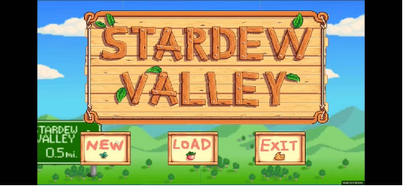

### 1.2 Project Function

The core features of this project include farm management, animal husbandry, community interaction, exploration and adventure, as well as character progression and a time system. With limited stamina and time each day, the player must plan their actions carefully and balance farming, social activities, gathering, and exploration to gradually build a prosperous farm and rich social network.

#### 1.2.1 Player and Farm Features
**Farm Management**
The player can till the soil, plant seeds, water fields, and harvest a variety of crops on designated farm tiles.

Crop growth and maturity depend on both crop type and season, and some crops are only available in specific seasons.
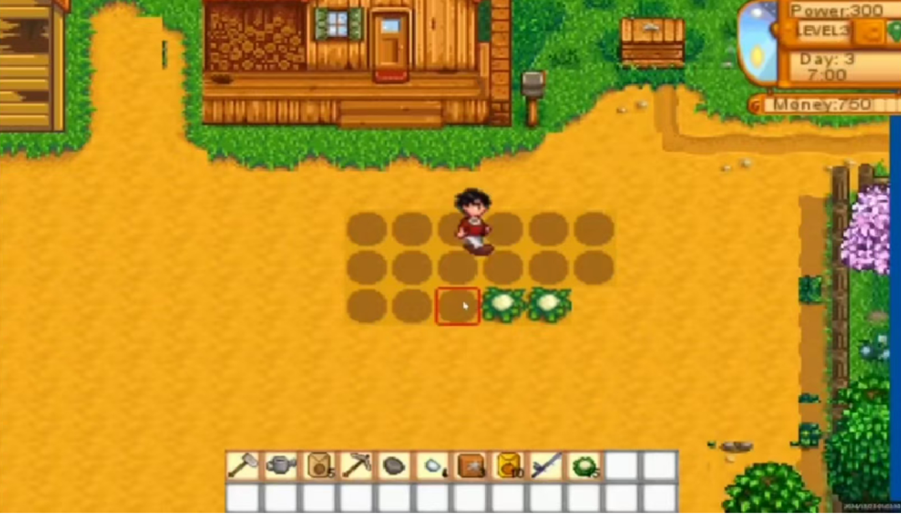

**Animal Husbandry**
The player can raise multiple kinds of livestock such as cows and chickens. Animals have attributes like satiety, value, and reproduction rate.

By feeding different types of fodder, the player can speed up growth and improve product quality. During night-time settlement, animals may grow, reproduce, or die if not properly fed.
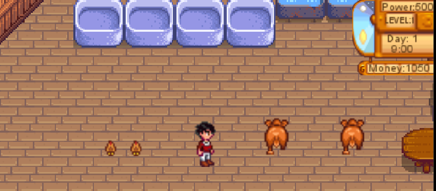

**Resource & Product Management**
The player can buy seeds, animal feed, and other resources from shops, and sell mature crops and animal products to earn money.

The inventory UI allows the player to view and manage all items, serving as the basis for crafting, trading, and gifting.

#### 1.2.2 Community and NPC Features

**Community Interaction**
The player can talk to town residents and give them gifts to increase friendship, unlocking more dialogue and interactive events.

Each NPC has preferred gifts that provide additional affection bonuses when given.
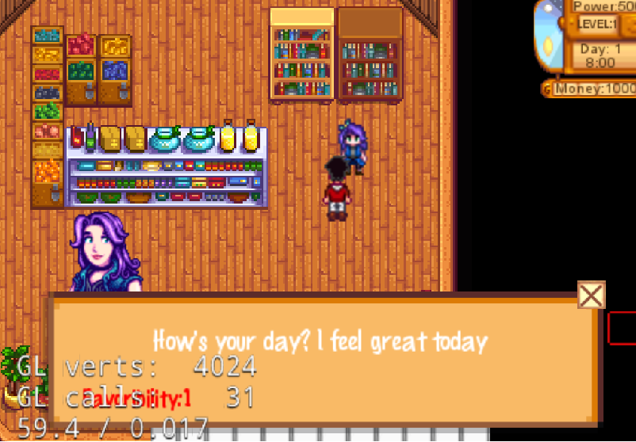

**Quest System**
The quest panel displays available commissions from residents, such as collecting specific items or helping repair buildings.

Completing quests rewards the player with money, items, or reputation and drives both character growth and town development.

#### 1.2.3 Exploration and Adventure Features

**Map Exploration**
The player can leave the farm and explore surrounding regions, including forests, mountains, mines, and the seaside.

Different regions provide distinct resources and interactions, enhancing openness and the sense of adventure.

**Mining & Gathering**
In mines, the player can excavate ores and rare materials used for crafting and trading.

In the wild, the player can gather wood, herbs, and other resources that are required for recipes or quests.
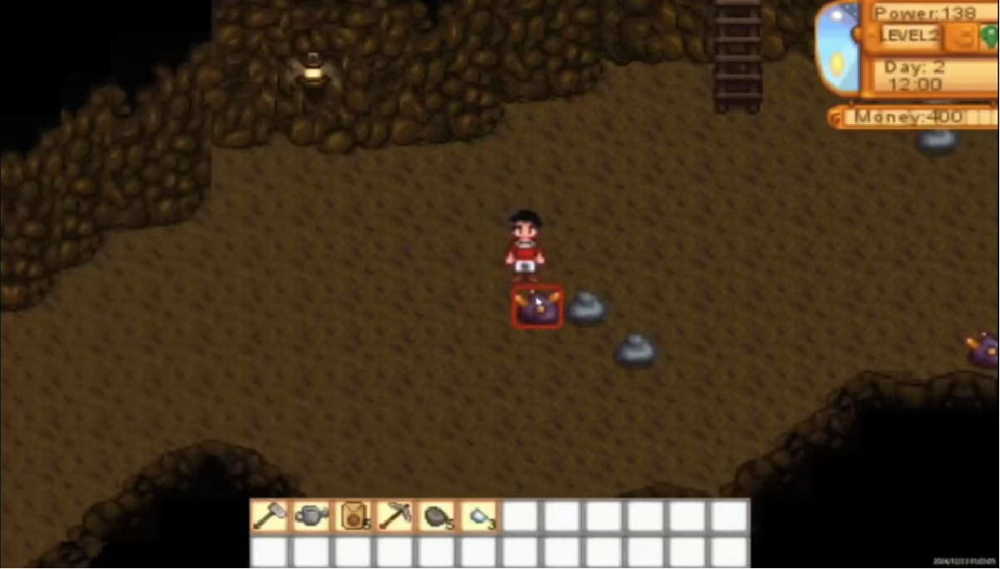

**Fishing System**

At specific water areas, the player can enter a fishing UI. Each cast yields fish or items with a certain degree of randomness.

Rare fish can be sold at high prices or used as special cooking ingredients.
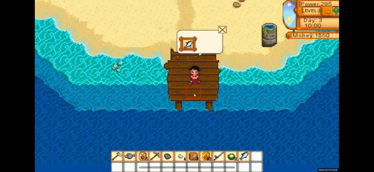


#### 1.2.4 Character Progression and System Features

**Time & Day-Night System**
The game features an in-game clock and calendar, mapping real time to in-game days with a fixed ratio.

At night or when the player chooses to sleep, the system settles daily events such as crop growth, animal updates, and quest refresh, and then automatically saves progress.

**UI & Scene Management**
The game provides various UI screens, including start menu, map scenes, inventory, shop, crafting, fishing, quest bar, NPC dialogue, and save/load interfaces.

A unified scene and UI management module handles map switching, layer stacking, and data persistence to ensure a smooth and cohesive gameplay experience.

## Creational Patterns

### Factory Pattern

#### Brief Introduction

#### Reason for Refactoring

#### Refactoring Details

#### UML Class Diagram

#### Benefits of Refactoring

## 3. Structural Patterns

#### Brief Introduction

#### Reason for Refactoring

#### Refactoring Details

#### UML Class Diagram

#### Benefits of Refactoring

### 3.2 Decorator Pattern

#### 3.2.1 Brief Introduction
The Decorator Pattern is a structural design pattern that allows behavior to be added to individual objects dynamically without changing their original class definitions. A decorator wraps a component object that implements the same abstract interface, and forwards most requests to this wrapped component. Additional responsibilities or states are then injected before or after the delegated calls. Client code interacts with the abstract interface and does not need to distinguish whether the object is a plain component or a component wrapped by multiple decorators.
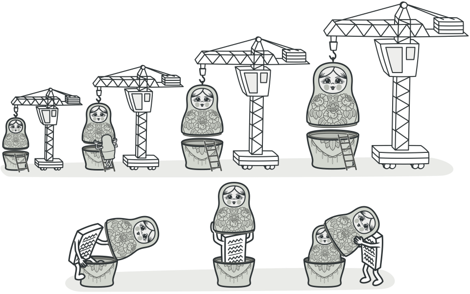
In this project, the Decorator Pattern is applied to model various crop states in the game, such as immature, mature, drought, pest, and withered. Each of these states is implemented as a concrete decorator. At runtime, different decorators can be composed on top of the same crop instance (e.g., “immature + pest + drought”), which avoids putting a large number of flags and conditional branches into a single `Crop` class.

#### 3.2.2 Reason for Refactoring
Before refactoring, a single Crop class typically represented all aspects of a crop, including:
* Life cycle (planted, growing, mature, withered);

* Daily watering status and pest infestation;

* Yield calculation and harvesting behavior;

* Binding and updating of the visual sprite on the tile-based map.

As more features were added, the Crop class became over-responsible. New states such as drought, pest, fertilizer effects, and special events were continuously added, leading to several problems:

1. God class problem: The Crop class violated the Single Responsibility Principle. Methods like dailySettle() and harvest() contained many intertwined conditional branches.

2. Poor extensibility for new states: Introducing a new state (e.g., disease or frost) required modifications to multiple data fields and methods inside Crop, increasing the risk of regression.

3. State explosion: When crops could simultaneously be “mature + drought + pest”, it became difficult to express such combinations clearly within a single class. Readability and maintainability were severely harmed.

4. Hard-to-test logic: Logic related to drought and pests was scattered across several methods, making it hard to test or reuse environmental effects in isolation.

Therefore, the refactoring goals were:

* Decouple “normal growth” behavior from “special state” behavior;

* Express complex state combinations via the composition of decorators;

* Reduce the invasiveness of new crop states on existing code, and improve extensibility and testability.
#### 3.2.3 Refactoring Details
After refactoring, the original Crop class is decomposed into several roles:

##### 1. Abstract Component – `BaseCrop`

`BaseCrop` defines the unified interface for crops: lifecycle methods such as init(...), dailySettle(), harvest(), and clear(), as well as state access methods like getLiveDay(), getMaturationDay(), isWatered(), and isWithered().
```cpp
class BaseCrop {
public:
    virtual ~BaseCrop() = default;

    // Life cycle
    virtual void init(cocos2d::Node* parent, const cocos2d::Vec2& tilePos) = 0;
    virtual void dailySettle() = 0;
    virtual bool harvest() = 0;
    virtual void clear() = 0;

    // State query
    virtual const std::string& getName() const = 0;
    virtual int  getLiveDay() const = 0;
    virtual int  getMaturationDay() const = 0;
    virtual bool isWatered() const = 0;
    virtual bool isWithered() const = 0;
    virtual void setWithered(bool withered) = 0;

    // Player / environment operations
    virtual void water() = 0;
    virtual void applyPesticide() = 0;
};
```
Client code (e.g., tiles and time manager) depends only on the BaseCrop abstraction, and does not care about the concrete implementation.

##### 2. Concrete Component – `BasicCrop`

`BasicCrop` implements the `BaseCrop` interface and encapsulates the core “normal growth” logic: crop name, current live days, maturation days, daily watering flag, and withered flag.

In dailySettle(), the crop grows if it was watered; otherwise, it stays at the same day count. Reaching the maturation day only affects the appearance but does not directly encode drought, pest, or other special rules.

updateSpriteFrame() updates the sprite color or frame according to the growth stage, providing basic visual feedback.
```cpp
class BasicCrop : public BaseCrop {
public:
    BasicCrop(const std::string& name, int maturationDay)
    : _name(name),
      _liveDay(0),
      _maturationDay(maturationDay),
      _watered(false),
      _withered(false),
      _parent(nullptr),
      _tilePos(Vec2::ZERO),
      _sprite(nullptr) {}

    void init(Node* parent, const Vec2& tilePos) override {
        _parent  = parent;
        _tilePos = tilePos;

        _sprite = Sprite::create();
        if (_sprite) {
            _sprite->setPosition(tilePos);
            if (_parent) _parent->addChild(_sprite);
        }
        updateSpriteFrame();
    }

    void dailySettle() override {
        if (_withered) return;

        if (_watered) {
            ++_liveDay;
            _watered = false;
        }

        if (_liveDay == 0 && !_watered) {
            _withered = true;
        }

        updateSpriteFrame();
    }

    bool harvest() override {
        if (!_withered && _liveDay >= _maturationDay) {
            clear();
            return true;
        }
        return false;
    }

    void clear() override {
        if (_sprite && _sprite->getParent())
            _sprite->removeFromParent();
        _sprite = nullptr;
    }

    // State access & operations
    const std::string& getName() const override { return _name; }
    int  getLiveDay() const override { return _liveDay; }
    int  getMaturationDay() const override { return _maturationDay; }
    bool isWatered() const override { return _watered; }
    bool isWithered() const override { return _withered; }
    void setWithered(bool w) override { _withered = w; }

    void water() override { _watered = true; }
    void applyPesticide() override { /* no-op for basic crop */ }

protected:
    std::string _name;
    int  _liveDay;
    int  _maturationDay;
    bool _watered;
    bool _withered;

    Node*   _parent;
    Vec2    _tilePos;
    Sprite* _sprite;

    void updateSpriteFrame() {
        if (!_sprite) return;

        if (_withered) {
            _sprite->setColor(Color3B::GRAY);
            return;
        }

        float ratio = _maturationDay > 0
                      ? static_cast<float>(_liveDay) / _maturationDay
                      : 1.0f;
        if (ratio < 0.33f)       _sprite->setColor(Color3B::GREEN);
        else if (ratio < 0.66f)  _sprite->setColor(Color3B::YELLOW);
        else                     _sprite->setColor(Color3B::ORANGE);
    }
};
```

##### 3. Abstract Decorator – `CropDecorator`

`CropDecorator` also implements `BaseCrop` and holds a `std::shared_ptr<BaseCrop>` named `_component`.

The default implementation simply forwards all calls to `_component`, such as dailySettle(), harvest(), water(), and applyPesticide().
```cpp
class CropDecorator : public BaseCrop {
public:
    explicit CropDecorator(std::shared_ptr<BaseCrop> component)
    : _component(std::move(component)) {}

    void init(Node* parent, const Vec2& tilePos) override {
        _component->init(parent, tilePos);
    }

    void dailySettle() override       { _component->dailySettle(); }
    bool harvest() override           { return _component->harvest(); }
    void clear() override             { _component->clear(); }

    const std::string& getName() const override   { return _component->getName(); }
    int  getLiveDay() const override              { return _component->getLiveDay(); }
    int  getMaturationDay() const override        { return _component->getMaturationDay(); }
    bool isWatered() const override               { return _component->isWatered(); }
    bool isWithered() const override              { return _component->isWithered(); }
    void setWithered(bool w) override             { _component->setWithered(w); }

    void water() override             { _component->water(); }
    void applyPesticide() override    { _component->applyPesticide(); }

protected:
    std::shared_ptr<BaseCrop> _component;
};
```
Concrete decorators override a subset of these methods and inject additional behavior before or after calling the base implementation.

##### 4. Concrete Decorators – Five Crop State Classes

**ImmatureCropDecorator**:
Overrides harvest() to disallow harvesting when liveDay < maturationDay and the crop is not withered, preventing accidental harvesting of immature crops.
```cpp
class ImmatureCropDecorator : public CropDecorator {
public:
    explicit ImmatureCropDecorator(std::shared_ptr<BaseCrop> component)
    : CropDecorator(std::move(component)) {}

    bool harvest() override {
        if (!isWithered() && getLiveDay() < getMaturationDay()) {
            return false; // prevent harvesting immature crops
        }
        return CropDecorator::harvest();
    }

    void dailySettle() override {
        CropDecorator::dailySettle();
        // optional: add “immature” effects here
    }
};

```
**MatureCropDecorator**:
Represents crops that have reached the maturation day. It can add visual hints in dailySettle() and optionally grant extra rewards in harvest() (e.g., additional yield).
```cpp
class MatureCropDecorator : public CropDecorator {
public:
    explicit MatureCropDecorator(std::shared_ptr<BaseCrop> component)
    : CropDecorator(std::move(component)) {}

    bool harvest() override {
        bool success = CropDecorator::harvest();
        if (success) {
            // optional: add extra rewards for perfectly mature crops
        }
        return success;
    }

    void dailySettle() override {
        CropDecorator::dailySettle();
        // optional: highlight mature crops
    }
};
```
**DroughtCropDecorator**:
Maintains a _continuousDryDays counter and updates it in dailySettle().

If the crop is not watered for several consecutive days, it calls setWithered(true) to mark the crop as withered.

water() clears the drought counter and forwards the call to the wrapped component.
```cpp
class DroughtCropDecorator : public CropDecorator {
public:
    explicit DroughtCropDecorator(std::shared_ptr<BaseCrop> component)
    : CropDecorator(std::move(component)),
      _continuousDryDays(0) {}

    void dailySettle() override {
        if (!isWatered() && !isWithered()) {
            ++_continuousDryDays;
            if (_continuousDryDays >= 3) {
                setWithered(true);
            }
        } else {
            _continuousDryDays = 0;
        }
        CropDecorator::dailySettle();
    }

    void water() override {
        _continuousDryDays = 0;
        CropDecorator::water();
    }

private:
    int _continuousDryDays;
};
```

**PestCropDecorator**:
Simulates pest damage in dailySettle() using random numbers. When _underPest is true, each day there is a certain probability that the crop becomes withered.

applyPesticide() clears the pest state by setting _underPest to false.
```cpp
class PestCropDecorator : public CropDecorator {
public:
    explicit PestCropDecorator(std::shared_ptr<BaseCrop> component)
    : CropDecorator(std::move(component)),
      _underPest(true) {}

    void dailySettle() override {
        CropDecorator::dailySettle();
        if (!_underPest || isWithered()) return;

        static std::default_random_engine engine(std::random_device{}());
        std::uniform_real_distribution<float> dist(0.0f, 1.0f);

        if (dist(engine) < 0.1f) {
            setWithered(true);
        }
    }

    void applyPesticide() override {
        _underPest = false;
        CropDecorator::applyPesticide();
    }

private:
    bool _underPest;
};
```

**WitheredCropDecorator**:

Calls setWithered(true) in the constructor to mark the underlying crop as withered.

dailySettle() no longer delegates to the inner component, stopping any further growth.

harvest() allows the player to clear the crop from the map but produces no yield.
```cpp
class WitheredCropDecorator : public CropDecorator {
public:
    explicit WitheredCropDecorator(std::shared_ptr<BaseCrop> component)
    : CropDecorator(std::move(component)) {
        setWithered(true);
    }

    void dailySettle() override {
        // Do nothing: no more growth after withering
    }

    bool harvest() override {
        clear();       // remove from the map, no yield
        return true;
    }

    bool isWithered() const override {
        return true;
    }
};
```

##### 5. Runtime Composition and Usage
At runtime, the game first creates a base crop:
```
std::shared_ptr<BaseCrop> crop =
    std::make_shared<BasicCrop>("Turnip", 4);
```
Then, depending on the current environment and state, it wraps the crop with different decorators:

* Newly planted crops are wrapped with ImmatureCropDecorator.
`crop = std::make_shared<ImmatureCropDecorator>(crop);`

* When the crop reaches the maturation day, it is wrapped with MatureCropDecorator.
`crop = std::make_shared<MatureCropDecorator>(crop);`
* If it is not watered during a day, a DroughtCropDecorator is added.
`crop = std::make_shared<DroughtCropDecorator>(crop);`
* Pest events attach a PestCropDecorator.
`crop = std::make_shared<PestCropDecorator>(crop);`
* Once the crop is determined to be withered, it is wrapped with WitheredCropDecorator to enforce withered semantics.
`crop = std::make_shared<WitheredCropDecorator>(crop);`

The client maintains only a `std::shared_ptr<BaseCrop>` and simply calls `crop->dailySettle()`, `crop->water()`, `and crop->harvest()` without needing to know how many decorators are stacked on top.

#### 3.2.4 UML Class Diagram
The following figure illustrates the UML class diagram of the crop refactoring using the Decorator Pattern.

* `BaseCrop` is the abstract component that defines the common interface for all crop objects.

* `BasicCrop` inherits from `BaseCrop` and is the only concrete component. It encapsulates the normal growth behavior and basic state management.

* `CropDecorator` also inherits from `BaseCrop`, but internally holds a BaseCrop reference via composition (- `component` : `BaseCrop`). It serves as the base class for all decorators.

* `ImmatureCropDecorator`, `MatureCropDecorator`, `DroughtCropDecorator`, `PestCropDecorator`, and `WitheredCropDecorator` all inherit from `CropDecorator`. Each of them overrides methods like `harvest()`, `dailySettle()`, `water()`, or `applyPesticide()` to inject state-specific logic.

#### 3.2.5 Benefits of Refactoring
By refactoring crops into the “base component + decorators” structure, the project gains several benefits:

##### 1. Clear separation of concerns
Normal growth behavior is encapsulated inside BasicCrop, while environmental and state-specific behaviors (drought, pest, withered, etc.) are isolated into their own decorator classes. This eliminates the need for a single class filled with numerous flags and conditional branches.

##### 2. Improved extensibility for new states
When new crop states are required (e.g., disease, frost, or fertilizer boost), developers only need to implement a new decorator that inherits from CropDecorator and override the necessary methods. The BasicCrop and existing decorators remain unchanged, which follows the Open–Closed Principle.

##### 3. Support for flexible state composition
Multiple decorators can be stacked on the same crop instance:

* A mature crop can simultaneously suffer from pests and drought.

* A newly planted crop can be instantly withered due to a special event. 

These combinations are expressed by nested wrappers instead of a huge method that handles all possible state combinations.

##### 4. Better readability and maintainability
Each decorator focuses on one concern, and its class name directly conveys its semantics (e.g., DroughtCropDecorator, PestCropDecorator). This makes the implementation easier to read, understand, and maintain, especially in a team setting.

##### 5. Easier testing and reuse
Each decorator can be tested independently. For example, one can specifically verify that “a crop becomes withered after three continuous dry days” or “pest infestation causes withering with a certain probability per day”. The same decorators can also be reused for multiple crop types without duplicating logic.
### Facade Pattern

#### Brief Introduction

The Facade pattern is a structural design pattern that provides a simplified, unified interface to a larger and more complex body of code, such as a subsystem or a library. It defines a higher-level interface that makes the subsystem easier to use by hiding its complexity. The primary intent is to decouple the client from the intricate workings of the subsystem, promoting a cleaner architecture and improving maintainability.

#### Reason for Refactoring

Before the refactoring, the project's architecture suffered from two main issues:

1.  **High Coupling and Low Cohesion**: Client classes like `AppDelegate`, `UILogic`, and `Gate` were directly coupled with multiple manager classes (`SceneManager`, `DocumentManager`, `TimeManager`). This forced clients to understand and manage complex interactions between different subsystems. For example, loading a game required the client to first call `DocumentManager` to load data and then `SceneManager` to switch the scene. This scattered logic made the client code hard to read, maintain, and extend.

2.  **Violation of the Single Responsibility Principle (SRP)**: The `SceneManager` class was overburdened with responsibilities. It not only managed scene transitions and lifecycle but also handled the creation, display, and hiding of all UI layers. This violated the SRP, making `SceneManager` a large and complex class that was difficult to manage.

The goal of the refactoring was to address these issues by introducing a facade to simplify the client interface and by separating concerns to improve class design.

#### Refactoring Details

The refactoring process was performed in two main stages: introducing the `GameFacade` and then separating UI management into a new `UIManager` class.

**1. Introducing the `GameFacade` Class**

A singleton class `GameFacade` was created to serve as a single entry point for all major game operations. It encapsulates the complex interactions between the various manager subsystems.

The interface of `GameFacade` exposes high-level methods that correspond to business logic, hiding the underlying implementation details.

*Code Snippet: `GameFacade.h` Interface*
```cpp
class GameFacade {
public:
    static GameFacade* getInstance();

    // --- High-level business process interfaces ---
    void startGame();
    void loadGame(int archiveNumber);
    void changeScene(const std::string& mapName, const std::string& position = "default");
    void showUI(const std::string& uiName, bool isBaseLayer = false);
    void hideUI(const std::string& uiName);
    void goToNextDay();

private:
    // References to core subsystems
    SceneManager* sceneManager_;
    TimeManager* timeManager_;
    DocumentManager* docManager_;
    UIManager* uiManager_;
};
```

Client code was then refactored to use this facade. For example, the application startup logic in `AppDelegate` was simplified significantly.

*Code Snippet: Client Code Refactoring in `AppDelegate.cpp`*
```cpp
// Before Refactoring (Conceptual)
// SceneManager::getInstance()->NextMap("introduction");

// After Refactoring
GameFacade::getInstance()->startGame();
```

**2. Creating `UIManager` to Separate Concerns**

To fix the SRP violation in `SceneManager`, a new `UIManager` class was created. All UI-related logic and responsibilities were moved from `SceneManager` to `UIManager`.

*Code Snippet: `UIManager.h` Interface*
```cpp
class UIManager {
public:
    static UIManager* getInstance();

    void initUIs();
    cocos2d::Node* getUINode();
    void showUILayer(const std::string& UI_name, bool base = false);
    void hideUILayer(const std::string& UI_name);
    // ...
};
```

The `GameFacade` was then updated to hold a reference to `UIManager` and delegate all UI-related calls to it, while `SceneManager` was cleansed of all UI management code, making its responsibilities purely focused on scene management.

#### UML Class Diagram

The following diagrams illustrate the structural changes before and after applying the Facade pattern.

**Before Refactoring**

The diagram below shows the high coupling, where client classes directly interact with multiple manager classes.

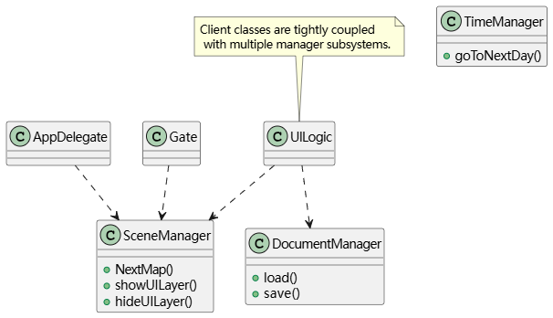

**After Refactoring**

This diagram shows the decoupled architecture. Clients only communicate with the `GameFacade`, which coordinates the subsystems. The responsibilities are also better separated with the introduction of `UIManager`.

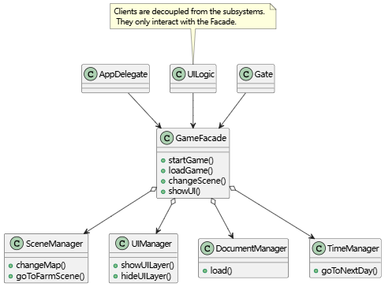

#### Benefits of Refactoring

The application of the Facade pattern yielded several significant benefits:

1.  **Simplified Client Interface**: Clients no longer need to manage complex interactions between subsystems. They can perform high-level operations like `loadGame()` with a single method call.
2.  **Reduced Coupling**: The client code is now decoupled from the internal implementation of the subsystems. Changes within the subsystems (e.g., modifying how scenes are loaded) have no impact on the client code as long as the facade's interface remains stable.
3.  **Improved Readability and Maintainability**: The code's intent is much clearer. A call to `GameFacade::getInstance()->startGame()` is more expressive and understandable than a series of calls to different managers. This makes the codebase easier to maintain and for new developers to understand.
4.  **Better Adherence to SRP**: By separating UI management into a dedicated `UIManager`, both `SceneManager` and `UIManager` now have clear, single responsibilities. This leads to a more organized and robust class structure.

## Behavioral Patterns

### Chain of Responsibility Pattern

#### Brief Introduction

#### Reason for Refactoring

#### Refactoring Details

#### UML Class Diagram

#### Benefits of Refactoring

### Strategy Pattern

#### Brief Introduction

#### Reason for Refactoring

#### Refactoring Details

#### UML Class Diagram

#### Benefits of Refactoring

## 5. Additional Patterns

### Null Object Pattern

#### 5.1 Brief Introduction
The Null Object Pattern is a behavioral design pattern that defines an object representing “absence” or “do-nothing” behavior, instead of using a null pointer/reference. The null object implements the same interface as real objects and provides safe, meaningful default behavior. Client code can uniformly invoke methods on the interface without checking for null, eliminating defensive null-checks scattered throughout the codebase.


In this project, the Null Object Pattern is applied to the player’s **currently held item** system. The original design used a raw pointer `Item* currentItem` that frequently became `nullptr` when the player held nothing. This forced more than 15 null-checks across interaction, UI, and inventory code (e.g., `if (currentItem != nullptr && currentItem->type == PICKAXE)`). By introducing a `NullItem` singleton that implements the full `Item` interface with safe no-op behavior, all null-checks are completely eliminated.

#### 5.2 Reason for Refactoring
Before refactoring, the item system suffered from classic “null pointer hell”:

1. **Frequent null checks** – Almost every interaction (mining, tilling, watering, eating, fishing) required `currentItem != nullptr` checks.
2. **Inconsistent return values** – `getCurrentItemType()` had to return `ItemType::NONE` via a ternary operator when `currentItem` was null.
3. **Error-prone pointer management** – When an item’s quantity reached zero, developers had to manually set `currentItem = nullptr`, risking dangling pointers.
4. **Poor readability and extensibility** – Adding a new tool (e.g., axe, sickle) required modifying every null-checking site.
5. **Violation of “Tell, Don’t Ask”** – Code constantly asked “do you have an item?” instead of simply telling the item to perform an action.

These problems became especially severe because **“holding nothing” is the most common player state** (approximately 70% of gameplay time), yet it was represented by the absence of an object rather than a proper object with defined behavior.

#### 5.3 Refactoring Details
The original value-type `struct Item` was transformed into a polymorphic hierarchy using the Null Object Pattern:

##### 1. Abstract Component – `Item`
```cpp
class Item {
public:
    virtual ~Item() = default;
    virtual ItemType    getType() const = 0;
    virtual std::string getIconPath() const = 0;
    virtual int         getQuantity() const { return 0; }
    virtual void        setQuantity(int) {}

    // Behavior queries (default: false/no-op)
    virtual bool isTool() const       { return false; }
    virtual bool canMine() const      { return false; }
    virtual bool canHoe() const       { return false; }
    virtual bool canWater() const     { return false; }
    virtual bool canFish() const      { return false; }
    virtual bool isConsumable() const { return false; }

    // Safe actions
    virtual void use() const {}
    virtual void consume() const {}
};
```

##### 2. Concrete Component – `RealItem`
Implements actual item logic (icon loading, quantity, tool/consumable checks, consumption that deducts quantity and restores energy).
```cpp
class RealItem final : public Item {
    // ... implements all meaningful behavior
    void consume() const override {
        if (MainCharacter::getInstance()->modifyItemQuantity(type_, -1)) {
            MainCharacter::getInstance()->modifyEnergy(getEnergyValue(type_));
        }
    }
};
```

##### 3. Null Object – `NullItem` (Singleton)
```cpp
class NullItem final : public Item {
private:
    NullItem() = default;
public:
    static NullItem* getInstance() {
        static NullItem instance;
        return &instance;
    }

    ItemType    getType() const override     { return ItemType::NONE; }
    std::string getIconPath() const override { return "ui/empty_hand.png"; }

    void use() const override {
        CCLOG("Nothing in hand");   // Optional feedback
    }
};
```

##### 4. MainCharacter Changes
```cpp
class MainCharacter {
private:
    std::vector<std::unique_ptr<RealItem>> inventory;   // Owns real items
    Item* currentItem = NullItem::getInstance();        // Never nullptr
};
```
- Constructor initializes `currentItem` to `NullItem::getInstance()`
- `setCurrentItem()` switches to a `RealItem*` or falls back to `NullItem`
- All inventory operations use `std::unique_ptr<RealItem>` for automatic memory management
- `getCurrentItem()` and `getCurrentItemType()` now have no null checks

#### 5.4 UML Class Diagram
The refactored structure forms a classic Null Object hierarchy:
- `Item` serves as the common abstract interface that defines all item-related operations.

- `RealItem` provides the full, meaningful implementation for actual tools and consumables.

- `NullItem` (implemented as a Meyers’ singleton) acts as the null object, returning safe default values (`ItemType::NONE`, empty icon path) and performing harmless no-op actions.

All client code — including `MainCharacter` character logic, tile interaction systems (mining, tilling, watering, fishing), inventory management, and UI rendering — now depends **solely on the `Item*` (or `const Item*`) abstraction. Crucially, **none of these clients ever perform a null-pointer check again**. Whether the player is holding a real pickaxe or nothing at all, the pointer is always valid and the polymorphic call is safe:


This transformation completely eliminates the null-checks that previously littered the codebase, achieving the ultimate goal of the Null Object Pattern: **the "absence" of an item is represented by a real object that knows how to behave correctly when absent**.

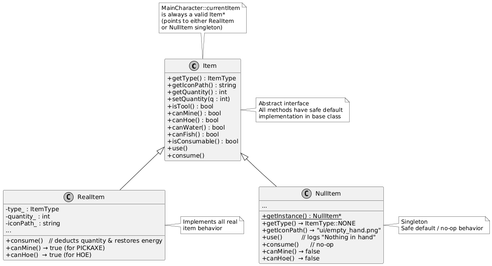

#### 5.5 Benefits of Refactoring
The application of the Null Object Pattern yielded significant improvements:

1. **Complete elimination of null checks**  
   Over 15 instances of `currentItem != nullptr` and ternary operators were removed.

2. **Safer and more robust code**  
   Impossible to accidentally dereference a null `currentItem`. The program is now immune to crashes caused by forgotten null checks.

3. **Cleaner, intention-revealing API**  
   Code changed from defensive “Ask” style:
   ```cpp
   if (currentItem && currentItem->type == PICKAXE) mine();
   ```
   to declarative “Tell” style:
   ```cpp
   if (currentItem->canMine()) mine();
   ```

4. **Greatly improved extensibility**  
   Adding a new tool (e.g., axe) only requires implementing `canChop()` in one `RealItem` case — no changes needed in any interaction site.

5. **Natural representation of the most common state**  
   “Empty hand” is now a first-class object with defined behavior (display empty-hand icon, safe no-op actions), perfectly matching real gameplay.

6. **Modern C++ memory safety**  
   Combined with `std::unique_ptr<RealItem>` in inventory, all item lifetime management is now fully RAII-compliant with zero manual deletes.

## AI Tools Usage in Refactoring

In our refactoring process, AI tools were employed strictly in an auxiliary capacity, functioning as an advanced research assistant rather than a direct contributor to the codebase. This strategic choice allowed us to leverage AI's powerful information retrieval capabilities while ensuring that all design decisions and code implementations remained human-led. Our usage can be detailed in three distinct phases:

### Phase 1: Initial Concept Exploration and Broad Literature Review

At the outset, our goal was to build a solid theoretical foundation for the chosen design patterns. We used AI to accelerate this learning process.

Instead of simple queries like "What is Facade Pattern?", we engaged the AI in a dialogue to explore the pattern's nuances. For instance, we prompted: *"Search for the explain of the Facade Pattern's role in game engine architecture and compare its typical use cases against the Mediator Pattern."* This provided a comparative analysis that was more insightful than a standard web search.


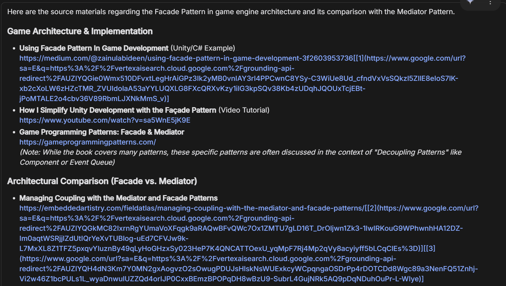
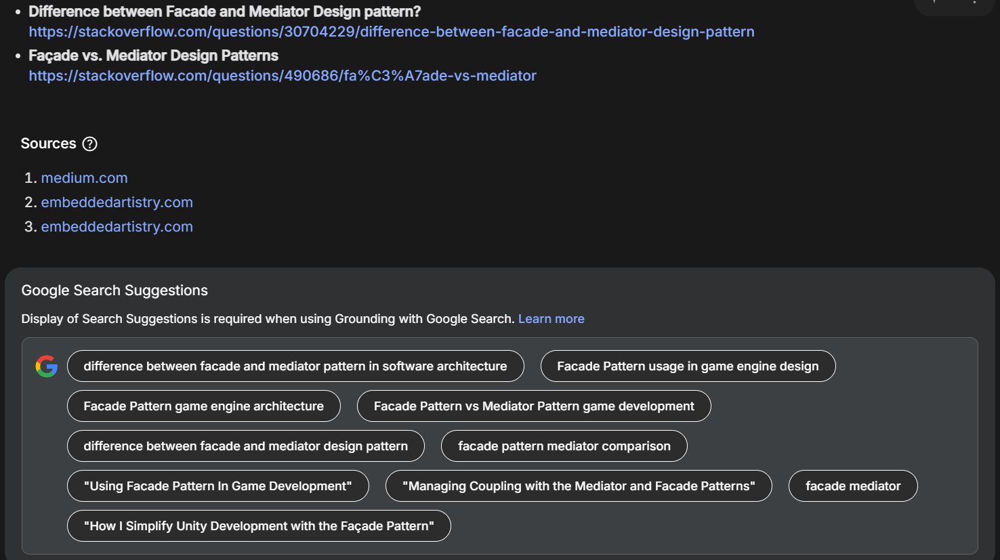

### Phase 2: Targeted Case Study and Implementation Research

Once we had a firm grasp of the theory, we needed practical, context-specific examples.

We narrowed our queries to find information relevant to our specific technology stack. For example: *"Find tutorials or GitHub repositories demonstrating Facade Pattern usage specifically within a Cocos2d-x project for managing game states and subsystems."*

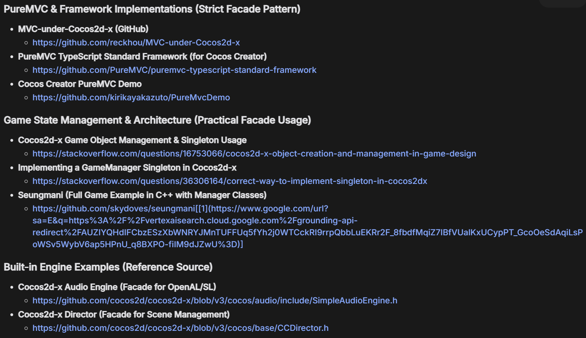
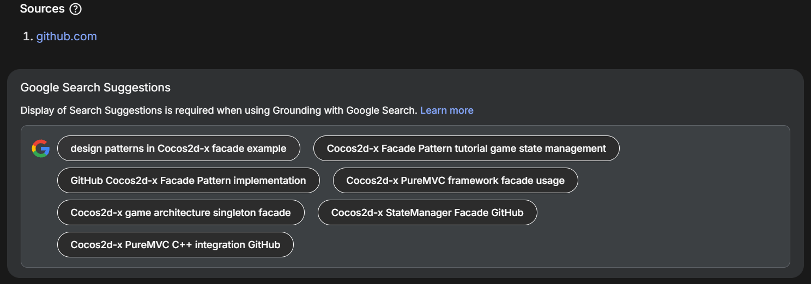

### Phase 3: Critical Analysis and Filtering of AI-Sourced Information

Crucially, our process involved a manual verification and filtering stage, reinforcing the human-in-the-loop principle.

*   **Information Validation**: We discovered that AI, while powerful, could sometimes provide outdated or overly complex information. For example, one AI-suggested implementation for a pattern used advanced C++17 features that were incompatible with our project's C++11 standard. This required us to critically evaluate the AI's output and manually adapt the concepts to our constraints.
*   **Synthesizing Knowledge**: The AI provided a wealth of raw information, but the task of synthesizing this information into a coherent design plan was entirely our own. We reviewed the collected articles, code examples, and discussions, debated the trade-offs, and then designed our `GameFacade` from scratch, informed by—but not dictated by—the AI-sourced materials.

### Reflection

This multi-phase approach proved highly effective. By defining the AI's role as a research assistant, we streamlined the often time-consuming process of literature review and technical research. The AI handled the "legwork" of finding relevant data, which freed up our cognitive resources to focus on the higher-level tasks of analysis, design, and implementation. This demonstrates a balanced and responsible use of AI in software engineering, where the tool enhances human intellect rather than replacing it.

## Reference
